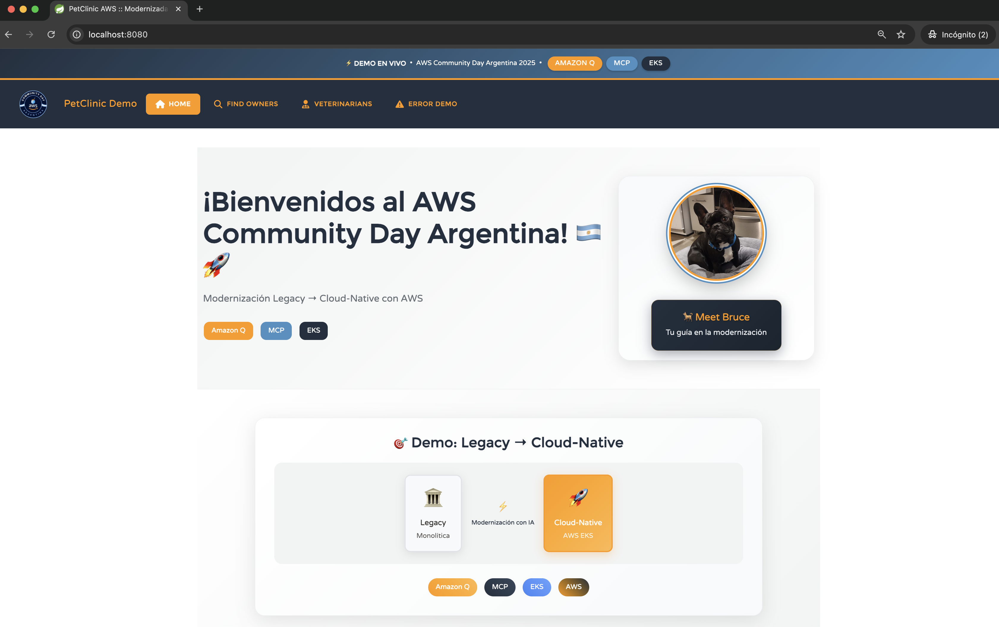
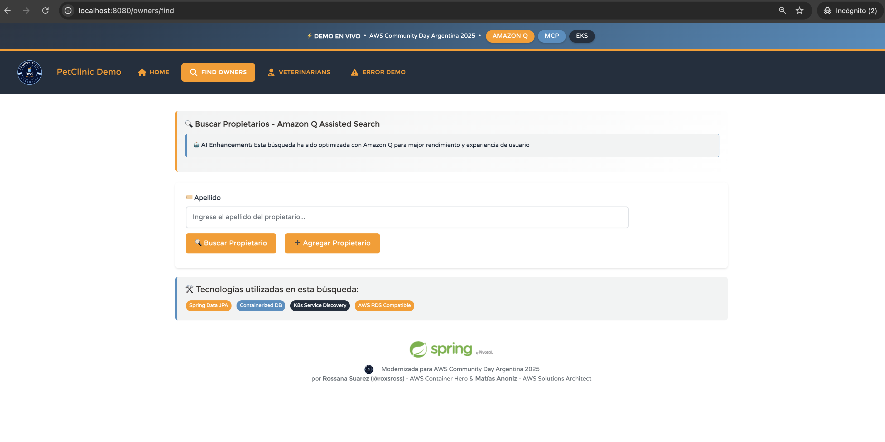
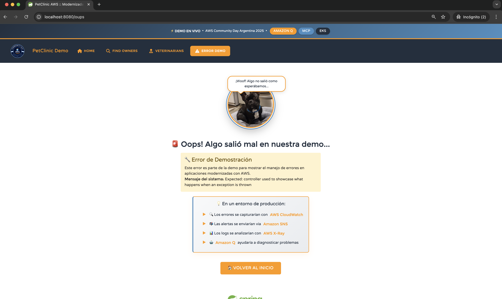

# Moderniza AWS Argentina 🇦🇷

Repositorio demo para la sesión ## 🛠️ Prerrequisitos para AWS despliega en AWS con MCP y Amazon Q"** en el **AWS Community Day Argentina 2025**.

Este proyecto muestra cómo dar nueva vida a aplicaciones heredadas utilizando:
- ✨ **Amazon Q Developer CLI** para asistir en la modernización del código
- 📦 **MCP (Modernization Containerization Platform)** para contenedorización rápida y segura
- 🚀 **Amazon EKS** para desplegar aplicaciones listas para escalar en la nube
- 🎨 **Frontend modernizado** con colores AWS y UX mejorada

La aplicación base es el clásico **Spring Petclinic**, completamente modernizado y preparado para correr en AWS.

---

## 🚀 Ejecutar Localmente

### Opción 1: Docker Compose (Recomendado)
```bash
# Clonar el repositorio
git clone https://github.com/roxsross/moderniza-aws-argentina.git
cd moderniza-aws-argentina

# Ejecutar con Docker Compose
docker-compose up

# Acceder a la aplicación
open http://localhost:8080
```

### Opción 2: Gradle (Desarrollo)
```bash
# Prerrequisitos: Java 11+ y Gradle instalado
git clone https://github.com/roxsross/moderniza-aws-argentina.git
cd moderniza-aws-argentina

# Ejecutar la aplicación
./gradlew bootRun

# Acceder a la aplicación
open http://localhost:8080
```

### Opción 3: Docker Manual
```bash
# Construir la imagen
docker build -t petclinic-modernized .

# Ejecutar el contenedor
docker run -p 8080:8080 petclinic-modernized

# Acceder a la aplicación
open http://localhost:8080
```

---

## 🛠️ Tecnologías Utilizadas

- **Backend:** Spring Boot 2.6.6, Spring Data JPA, Spring MVC
- **Frontend:** Thymeleaf, Bootstrap, Font Awesome 6
- **Base de datos:** H2 (desarrollo), MySQL/PostgreSQL (producción)
- **Contenedorización:** Docker, Docker Compose
- **Nube:** Amazon EKS, AWS RDS, Amazon ECR

---

## 🛠️ Prerrequisitos para AWS

- [Docker](https://docs.docker.com/get-docker/) instalado
- [AWS CLI](https://docs.aws.amazon.com/cli/) configurado
- [kubectl](https://kubernetes.io/docs/tasks/tools/) instalado
- [Amazon Q Developer CLI](https://aws.amazon.com/q/developer/) habilitado
- Acceso a un cluster de **Amazon EKS** o [eksctl](https://eksctl.io/) para crear uno

---

## 📁 Estructura del Proyecto

```
moderniza-aws-argentina/
├── src/
│   ├── main/
│   │   ├── java/                    # Código Java Spring Boot
│   │   ├── resources/
│   │   │   ├── templates/           # Templates Thymeleaf modernizados
│   │   │   ├── static/             # CSS, JS, imágenes
│   │   │   └── db/                 # Scripts de base de datos
│   └── test/                       # Tests unitarios
├── docker-compose.yml              # Configuración Docker Compose
├── Dockerfile                      # Imagen Docker optimizada
├── build.gradle                    # Configuración Gradle
└── README.md                       # Este archivo
```
---

## 🎯 Objetivo

Que cualquier desarrollador pueda:

1. ✅ Tomar una app **legacy** (Spring Petclinic)
2. ✨ Modernizarla con ayuda de **Amazon Q Developer**
3. 📦 Empaquetarla en un contenedor usando **Docker**
4. 🚀 Desplegarla en **Amazon EKS** con un flujo asistido por IA

---

## � Screenshots

### Página Principal Modernizada


### Gestión de Owner


### Gestión de Veterinarios


### Página de Error Personalizada


---

## 📈 Monitoreo y Observabilidad

La aplicación incluye:
- **Spring Boot Actuator** para métricas
- **Health checks** para Kubernetes
- **Logs estructurados** para CloudWatch
- **Prometheus metrics** endpoint

```bash
# Endpoints de monitoreo
curl http://localhost:8080/actuator/health
curl http://localhost:8080/actuator/metrics
curl http://localhost:8080/actuator/info
```

---

## 🙌 Créditos

Basado en [Spring PetClinic](https://github.com/spring-projects/spring-petclinic).
Modernizado para **AWS Community Day Argentina 2025**.

### 🎤 Speakers

- **Rossana Suarez (@roxsross)** – AWS Container Hero, Tech Lead DevOps
- **Matías Anoniz** – Solutions Architect, AWS

---

## 📄 Licencia

Este proyecto está bajo la licencia Apache 2.0. Ver el archivo [LICENSE](LICENSE.txt) para más detalles.

---

⭐ **¡Dale una estrella al repo!** ⭐
